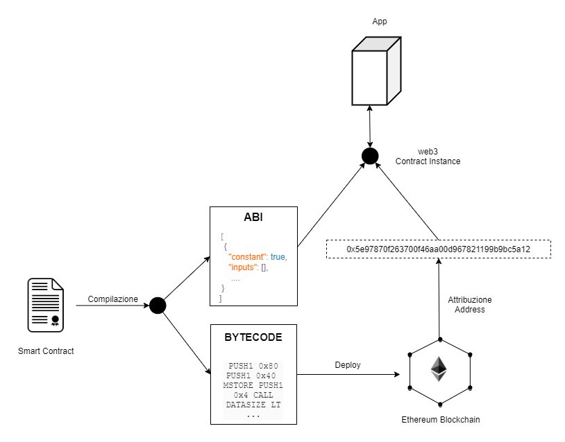
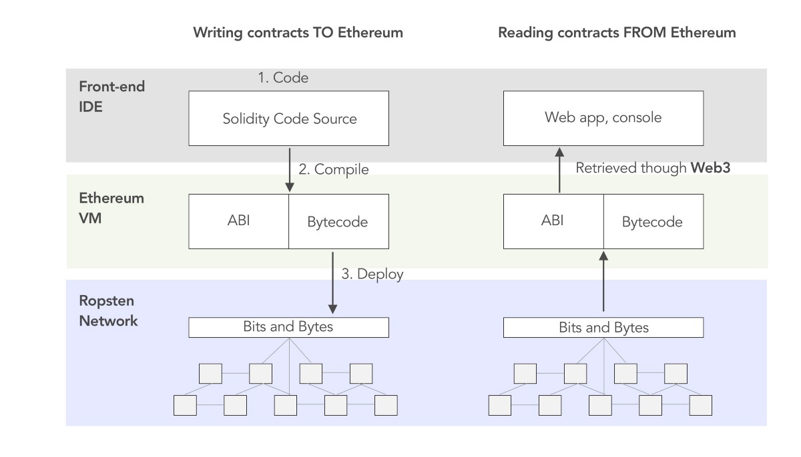
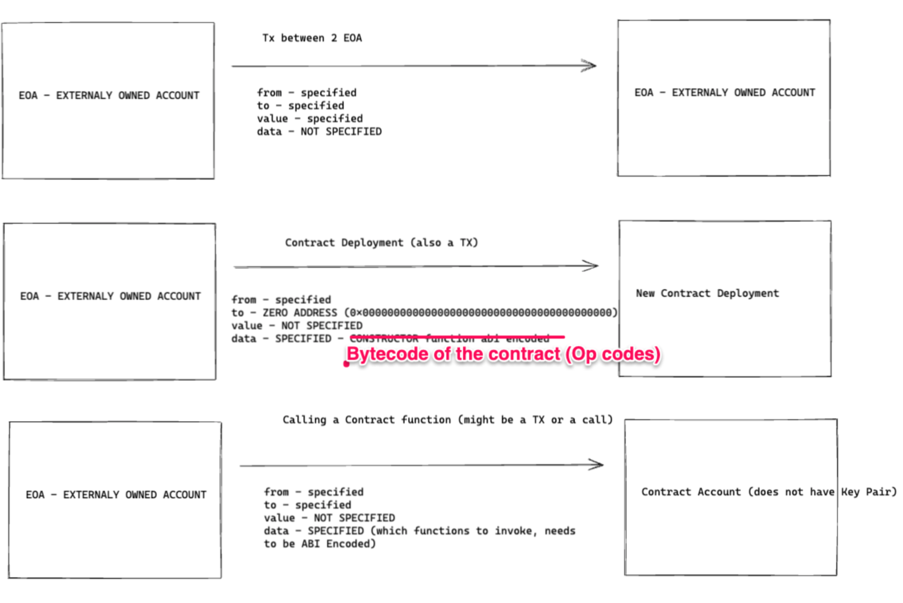
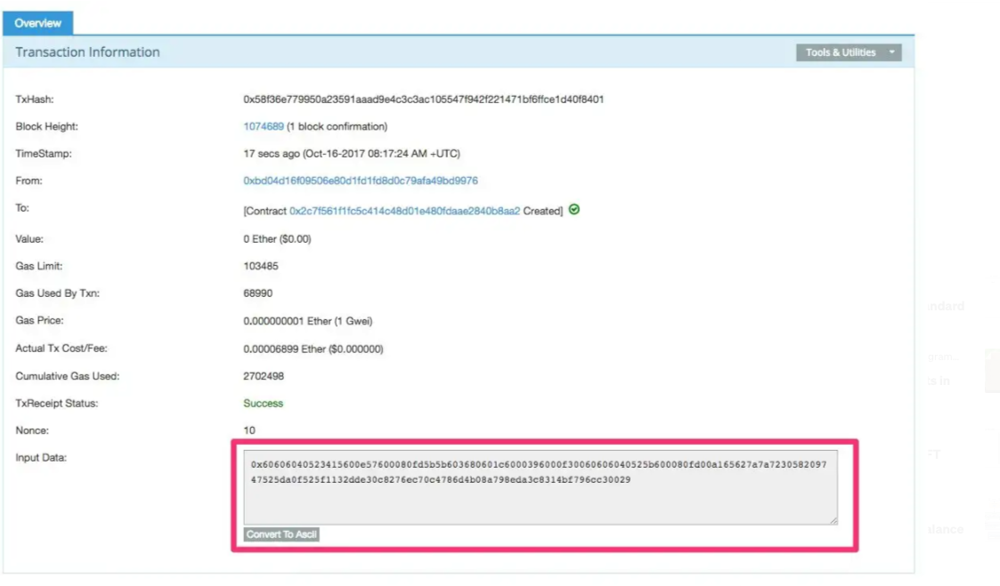

### Resources 
* [The Smart Contract Creation Process](https://medium.com/@hayeah/diving-into-the-ethereum-vm-part-5-the-smart-contract-creation-process-cb7b6133b855) 
* [Smart Contract Deployment](https://medium.com/coinmonks/smart-contract-deploy-b98469e3e158)
* [Explaining Ethereum Contract ABI & EVM Bytecode](https://medium.com/@eiki1212/explaining-ethereum-contract-abi-evm-bytecode-6afa6e917c3b)

# Contract Compilation 



The compilation of a contract basically produces two results that specifically are:

## **Bytecode** 
* which is a stack-based machine language compiled and executable by the EVM (Ethereum -Virtual Machine). For each instruction implemented by the Smart Contract on the EVM, a system keeps track of the execution cost and this is measured in a unit of gas;
e.g. 
```
PUSH1 0x80 PUSH1 0x40 MSTORE PUSH1 0x4 CALLDATASIZE LT PUSH2 0x41 JUMPI PUSH1 0x0 CALLDATALOAD PUSH29 0x100000000000000000000000000000000000000000000000000000000 SWAP1 DIV PUSH4 0xFFFFFFFF AND DUP1 PUSH4 0xCFAE3217 EQ PUSH2 0x46 JUMPI JUMPDEST PUSH1 0x0 DUP1 REVERT JUMPDEST CALLVALUE DUP1 ISZERO PUSH2 0x52 JUMPI PUSH1 0x0 DUP1 REVERT JUMPDEST POP PUSH2 0x5B PUSH2 0xD6 JUMP JUMPDEST PUSH1 0x40 MLOAD DUP1 DUP1 PUSH1 0x20 ADD DUP3 DUP2 SUB DUP3 MSTORE DUP4 DUP2 DUP2 MLOAD DUP2 MSTORE PUSH1 0x20 ADD SWAP2 POP DUP1 MLOAD SWAP1 PUSH1 0x20 ADD SWAP1 DUP1 DUP4 DUP4 PUSH1 0x0 JUMPDEST DUP4 DUP2 LT ISZERO PUSH2 0x9B JUMPI DUP1 DUP3 ADD MLOAD DUP2 DUP5 ADD MSTORE PUSH1 0x20 DUP2 ADD SWAP1 POP PUSH2 0x80 JUMP JUMPDEST POP POP POP POP SWAP1 POP SWAP1 DUP2 ADD SWAP1 PUSH1 0x1F AND DUP1 ISZERO PUSH2 0xC8 JUMPI DUP1 DUP3 SUB DUP1 MLOAD PUSH1 0x1 DUP4 PUSH1 0x20 SUB PUSH2 0x100 EXP SUB NOT AND DUP2 MSTORE PUSH1 0x20 ADD SWAP2 POP JUMPDEST POP SWAP3 POP POP POP PUSH1 0x40 MLOAD DUP1 SWAP2 SUB SWAP1 RETURN JUMPDEST PUSH1 0x60 PUSH1 0x40 DUP1 MLOAD SWAP1 DUP2 ADD PUSH1 0x40 MSTORE DUP1 PUSH1 0x5 DUP2 MSTORE PUSH1 0x20 ADD PUSH32 0x48656C6C6F000000000000000000000000000000000000000000000000000000 DUP2 MSTORE POP SWAP1 POP SWAP1 JUMP STOP LOG1 PUSH6 0x627A7A723058 KECCAK256 SLT 0xec 0xe 0xf5 0xf8 SLT 0xc7 0x2d STATICCALL ADDRESS SHR 0xdb COINBASE 0xb1 BALANCE 0xe8 0xf8 DUP14 0xda 0xad DUP13 LOG1 0x4c 0xb4 0x26 0xc2 DELEGATECALL PUSH7 0x8994D3E002900
```
## **ABI** 
* or Application Binary Interface, which is a JSON file that describes the distributed contract and the functions of the smart contract. The ABI is critical to the application (web or mobile) as it allows you to know the contract interface and then call the various functions executed at the EVM level.


# Transaction Types



# Deployment Process

## 1. Let’s create a simple (and completely useless) contract:
```solidity
pragma solidity ^0.4.11;
contract C {
}
```

## 2. Compile it to get the bytecode (also need to get ABI spec with --abi flag):
```bash
solc --bin --asm c.sol
```

And the bytecode is:

```
60606040523415600e57600080fd5b5b603680601c6000396000f30060606040525b600080fd00a165627a7a723058209747525da0f525f1132dde30c8276ec70c4786d4b08a798eda3c8314bf796cc30029
```

## 3. To create this contract (deploy to EVM),
we’ll need to create a transaction by making an ```eth_sendtransaction``` RPC call to an Ethereum node. You could use Remix or Metamask to do this.

Whatever deployment tool you use, the parameters for the RPC call would be something similar to:

```json
{
"from": "0xbd04d16f09506e80d1fd1fd8d0c79afa49bd9976",
"to": null,
"gas": "68653", // 30400,
"gasPrice": "1", // 10000000000000
"data": "0x60606040523415600e57600080fd5b603580601b6000396000f3006060604052600080fd00a165627a7a723058204bf1accefb2526a5077bcdfeaeb8020162814272245a9741cc2fddd89191af1c0029"
}
```
There is no special RPC call or transaction type to create a contract. The same transaction mechanism is used for other purposes as well:

* Transferring Ether to an account or contract.
* Calling a contract’s method with parameters.


Depending on what parameters you specified, the transaction is interpreted differently by Ethereum. **To create a contract, the to address should be null (or left out).**

Opening Etherscan, you should see that the input data for this transaction is the bytecode produced by the Solidity compiler:



## Interacting with Contract
For example, if you want to call a function in a smart contract with your JavaScript code, ABI plays a role as an intermediary between your JavaScript code and EVM bytecode to interact with each other. Below diagram shows the architecture of Contract ABI, EVM bytecode and outside components(dApp and network). The left side is a process of compiling and the right side is interacting.


Contract ABI defines function names and argument data types. It is used to encode contract calls for the EVM and to read data out of transactions. There is a clear specification of how to encode and decode Contract ABI. I will use the below function to describe the example of encoding.

```solidity
function withdraw(uint withdraw_amount) public {}
```
1. First, “withdraw” function will be **encoded with keccak256 and first 4 bytes are used as a selector**. the selector is a mark to be used to identify which function to call.

```bash
// Encode function with keccak256.
> web3.utils.sha3(“withdraw(uint256)”)
0x2e1a7d4d13322e7b96f9a57413e1525c250fb7a9021cf91d1540d5b69f16a49f
// Extract first 4 bytes.
0x2c1a7d4d
```
2. Next, the **argument will be encoded in hex decimal and appended to encoded “withdraw” function with 32 bytes padding.**
```bash
// Convert from ETH to Wei.
> withdraw_amount = web3.utils.toWei(“0.01", “ether”);
10000000000000000
// Convert Wei with hexdecimal.
> withdraw_amount_hex = web3.toHex(withdraw_mount);
0x2386f26fc10000
// Left padding.
> withdraw_amount_padleft = web3.utils.leftPad(withdraw_amount_hex, 32);
0x0000000000000000002386f26fc10000
// Append to selector(encoded function).
“0x2c1a7d4d” + withdraw_amount_padleft
// Final encoded ABI.
0x2c1a7d4d0x0000000000000000002386f26fc10000
```
The data invokes withdraw function and requesting 0.01 as the argument. If you want to know details about ABI encoding/decoding specification, please refer to Contract ABI Specification.


